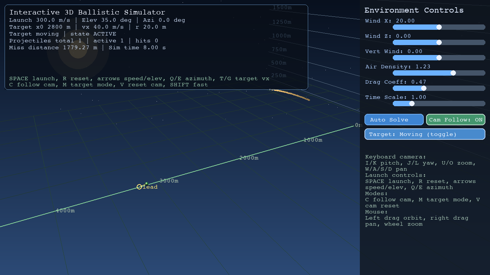
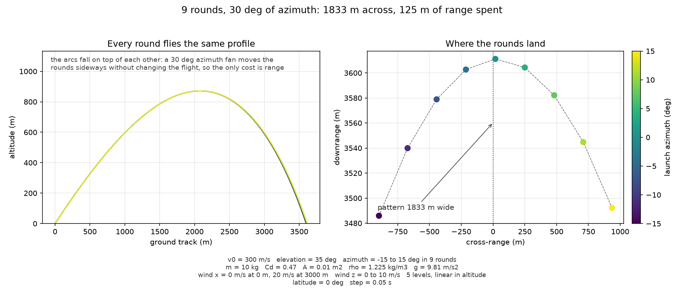
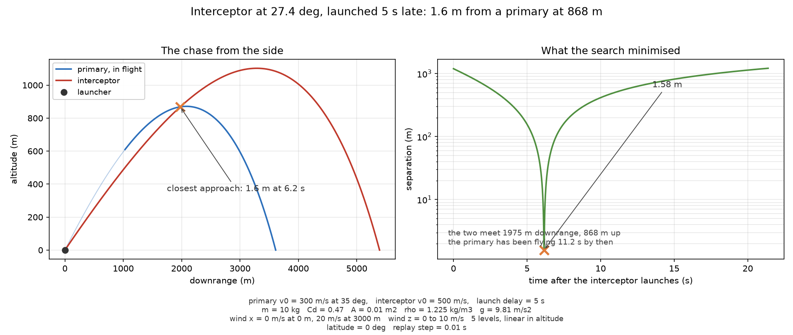

# Ballistic Trajectory Simulator


A three-dimensional ballistics solver with drag, altitude-dependent wind shear,
and Coriolis deflection, plus a launch solution search that finds speed,
elevation, and azimuth to reach a moving target.

The headline result is the measured disagreement between the two integrators:
the search integrates with adaptive RK45 while the real-time renderer steps
with fixed-step RK4 through the same acceleration model, and at the renderer's
60 fps step the two answers land 7.3e-6 m apart. Semi-implicit Euler at the
same step would sit 5.14 m off, which is why the renderer does not use it.
The full account is in `docs/approach.md`.

## Commands

- `solve`: searches for a launch solution that reaches the target and prints
  the elevation, whether the projectile hit, and the miss distance
- `render`: runs the interactive real-time window

```bash
uv run python main.py solve --headless
```

```bash
uv run python main.py render
```

The salvo dispersion and the intercept are figures, not commands. Both run
without a display, state the launch conditions they flew, and write into
`figures/`.

## Figures

Every figure below is produced by a script, and one command redraws all of them:

```bash
uv run python scripts/make_figures.py
```

### The two integrators


The convergence sweep compares adaptive RK45 against fixed-step methods from
0.1 s down to 0.0001 s at 300 m/s and 35 degrees of elevation, so the
observed order of accuracy is legible from the slopes and the renderer's step
is verifiable rather than plausible. The finding above comes from a generated
figure rather than a sentence.

### The real-time renderer



The renderer mid-trajectory: one projectile at 300 m/s and 35 degrees, eight
seconds into its trajectory toward a target walking toward the launcher at
40 m/s. It is a screenshot of the running window at 1280 by 720, captured
without a display by the figure generator, not a drawing of what it might
look like.

### The salvo

Nine projectiles at the same speed and elevation, spread across 30 degrees of
azimuth. They fly the same profile and land 1833 m apart.



### The intercept

An interceptor launched five seconds after a primary that is already 1150 m
downrange. The search names the elevation, the trajectory is replayed at a
tighter step, and the two pass within 1.6 m of each other. The target here is
itself a projectile, which is what makes this an interceptor problem rather
than a second launch solution.



The individual generators are `scripts/integrator_convergence.py`,
`scripts/salvo_dispersion.py`, `scripts/intercept.py`, and
`scripts/renderer_screenshot.py`. Each takes an output path argument and
prints the launch conditions it flew. Nothing in `figures/` is a screenshot
nobody can reproduce: a committed figure with no generator behind it fails
the suite.

## Approach

`docs/approach.md` explains why the launch solution is found by search rather
than solved in closed form — drag acts on relative airspeed and the wind table
is sampled by altitude, so neither admits an analytic inverse — how the coarse
pass and the refinement converge to 0.02 degrees in elevation, and where the
model stops: Earth curvature drop is a post-hoc altitude correction and the
Coriolis deflection omits the vertical component, which bounds the model to a
few kilometres against a 20 m target.

## Setup

Needs Python 3.11 or newer, which is what the numpy and scipy floors in
`pyproject.toml` require. [uv](https://docs.astral.sh/uv/) handles the
interpreter, the environment, and the lockfile.

Install the project and its test dependencies into `.venv`:

```bash
uv sync
```

`uv.lock` is committed and holds the exact versions the documented physics
results were computed against. `uv sync` installs from it, so a fresh checkout
resolves to the same numbers this README reports.

Run the test suite:

```bash
uv run pytest
```

Solve a launch solution against a target and report it. `--headless` closes the
figure instead of showing it, so the command runs on a machine with no display.

```bash
uv run python main.py solve --headless
```

Run the real-time renderer:

```bash
uv run python main.py render
```

## Headless

`--headless` belongs to `solve`, which reports the same thing with or without a
window. It selects the non-interactive matplotlib backend, so the command still
computes and prints its results and still writes a GIF export.

`render` has no such flag. A window is the whole point of it, so passing
`--headless` to `render` is an error.

## Examples

Solve against a stationary target:

```bash
uv run python main.py solve --launch-speed 300 --target-x 3500 --headless
```

Solve against a target walking towards the launcher:

```bash
uv run python main.py solve --target-x 2000 --target-velocity-x 40 --headless
```

Solve with Earth curvature drop in the model:

```bash
uv run python main.py solve --enable-earth-curvature --headless
```

Export the trajectory as an animation:

```bash
uv run python main.py solve --output-gif-path trajectory.gif --output-gif-fps 30 --headless
```

Run the renderer against a moving target:

```bash
uv run python main.py render --launch-speed 300 --launch-elevation-deg 35 --launch-azimuth-deg 5 --target-x 2800 --target-velocity-x 40 --target-radius 20
```

Renderer controls:

- `SPACE`: launch projectile
- `R`: reset simulation
- `UP/DOWN`: elevation angle
- `LEFT/RIGHT`: launch speed
- `Q/E`: azimuth angle
- `T/G`: target speed
- `I/K`: camera pitch up/down
- `J/L`: camera yaw left/right
- `U/O`: camera dolly in/out
- `W/A/S/D`: camera pan on ground plane
- sliders on the right: wind table scaling, air density, drag coefficient, time scale

## Auto Solve

The real-time window's Auto Solve button searches for a launch speed, elevation,
and azimuth that hits the target. The search is bounded by a budget in candidate
trajectories rather than by a stopwatch, so it returns the same launch solution
for the same input on any machine. The status line under the buttons says how
many candidates it spent and whether that was the whole search or the budget it
was given, so a launch solution that is the best it found is never read as the
best available.

## Arguments

`solve` takes:

- `--launch-speed`: launch speed in m/s
- `--target-x`: initial target X position in meters
- `--target-radius`: target radius in meters
- `--target-velocity-x`: target velocity along X in m/s
- `--enable-earth-curvature`: correct for Earth curvature drop in the model the launch solution is solved against
- `--output-gif-path`: write the trajectory out as an animated GIF
- `--output-gif-fps`: GIF frame rate
- `--headless`: do not open a plotting window

`render` takes:

- `--launch-speed`: launch speed in m/s
- `--launch-elevation-deg`: launch elevation angle in degrees
- `--launch-azimuth-deg`: launch azimuth angle in degrees
- `--target-x`: initial target X position in meters
- `--target-radius`: target radius in meters
- `--target-velocity-x`: target velocity along X in m/s

Developed with AI assistance throughout, reviewed line by line before each commit.
