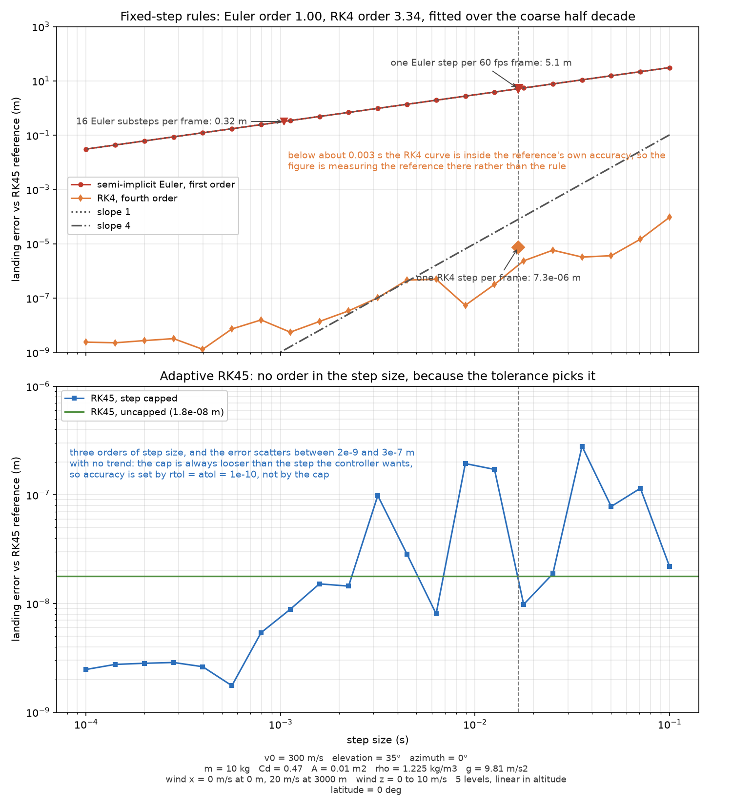

# Approach

This project integrates the trajectory of a projectile through drag, wind shear, and Coriolis deflection, then searches launch parameters until the trajectory reaches a target. The integration is the easy part to explain. The search is the part worth writing down, because it is where the project spends its judgment.

A launch solution here means a speed, elevation, and azimuth that puts the projectile within the target radius. A hit is decided by miss distance, the smallest distance between the trajectory and the target at any point along the flight. Zero or less means a hit.

## Why the launch solution is searched, not solved

In a vacuum there is a closed form. Range is launch speed squared times sin(2θ) over g, and the suite checks the integrator against it. The project does not fly in a vacuum, and two things break the formula.

The first is drag. Drag here is quadratic in relative airspeed and points along the relative velocity vector, which is projectile velocity minus the wind at the current altitude. That makes acceleration a nonlinear function of velocity, so the trajectory has no closed form to invert. You cannot solve for the angle that gives a range when range itself is only defined by integrating.

The second is wind shear. The wind table holds wind components at discrete altitude levels and interpolates linearly between them, so the wind a projectile feels changes as it climbs and descends. The acceleration at any moment depends on where the projectile is, which depends on the whole flight before it. A formula that assumes one wind value for the flight answers a different problem.

A moving target removes the last foothold a formula could stand on. With a stationary target you can at least bracket a range. With a target walking toward the launcher, the range to cover changes while the projectile is in the air, so there is nothing fixed to solve for. The only stable question is which angle minimizes the miss distance, and that is a search by nature.

The search does use the analytic answer, just not as the answer. The coarse sweep seeds each candidate flight time with the vacuum elevation for that time, then flies it through the full model and keeps score. The formula proposes, the integrator disposes.

## How the search converges

There are three searches, and they share one shape. A coarse pass over the whole space, a fine pass around the winner, and a replay of the winner at a tighter step to report the number honestly.

For a stationary target, the search flies 177 elevations from 1 to 89 degrees, a 0.5 degree grid, and takes the first sign change in range minus target range as a bracket. Brent's method then refines inside that half-degree bracket. If nothing brackets, because the target is out of reach, the solve path falls back to the sweep below and reports the closest flight instead of raising.

For a moving target, or for an interceptor chasing a projectile already in flight, the sweep minimizes miss distance directly. The coarse pass flies 89 elevations at 1 degree spacing and keeps the best. The fine pass flies 101 elevations across a 2 degree window around that best, which is 0.02 degrees per step. The winner is then flown again at max_step 0.05 instead of the search's 0.1, and the miss distance is scored again on that replay. The reported number comes from the tighter flight, not from the grid that found it.

The renderer's Auto Solve searches speed and azimuth too, not just elevation: 54 flight times by 7 azimuths coarse, then 7 by 7 by 7 around the winner. The ceiling is 721 candidate flights by arithmetic, and the default budget of 1000 sits above it, so a default solve always sees the whole grid and returns the same answer on every machine. A smaller budget returns the best of a prefix and says so.

The resolution the search reaches is 0.02 degrees in elevation for the angle sweeps, with the winner confirmed on a tighter replay. The refinement window is narrow enough that the answer is a local minimum of miss distance rather than the edge of a grid.

## Two integrators, one measured disagreement

The search integrates with adaptive RK45. The renderer steps with a fixed step, one per frame, because a real-time loop cannot let a tolerance controller pick its step count after the fact. Both call the same acceleration function, so the only thing separating their answers is the step rule, and the project measured it instead of assuming it.

For the renderer's default launch, 300 m/s at 35 degrees, semi-implicit Euler at one step per 60 fps frame lands 5.14 m from the adaptive answer. Sixteen substeps per frame bring that to 0.32 m. Fixed-step RK4 at one step per frame lands 7.3e-6 m away, five orders of magnitude closer than Euler for four acceleration evaluations instead of one.

So the renderer now steps with fixed-step RK4 through the same physics function the search uses, and the gap between the angle the search recommends and the trajectory the window draws falls from metres to under a hundredth of a millimetre. It costs 27 microseconds per projectile per frame instead of 6, against a 16.7 ms frame. The convergence figure shows the full sweep:

## Where the model stops

Two approximations bound how far this model should be trusted, and both are deliberate. They are cheap where the project flies and wrong where it does not, and the boundary is worth stating plainly.

Earth curvature drop is applied after the integration, not inside it. Each altitude sample is lowered by ground range squared over twice the Earth radius, while gravity stays vertical and the range and flight time come from the flat integration unchanged. At 3.5 km the correction is about a metre; at 10 km near 8 m; at 20 km past 31 m. Against a 20 m target radius, the model is comfortable inside a few kilometres and honest about losing that comfort past ten. A curved reference frame would tilt gravity along the flight and change the range itself. This correction moves the ground, not the trajectory.

The Coriolis deflection omits its vertical component. The code applies the two horizontal terms and nothing along the vertical. A due-north shot at 45 degrees latitude drifts about half a metre sideways in this model, which matches the expected order of magnitude. The missing vertical term scales the same way, with velocity and flight time. Restoring it moves the landing about 3 m on the default 3.6 km flight at 45 degrees latitude, against the half-metre sideways drift the kept terms produce on a shorter shot. So it stays inside the target radius on short flights and grows into metres on long ones. Same boundary as above: fine inside a few kilometres, a known bias beyond.

Neither limit is an apology. Every model ends somewhere, and these two end past the ranges the project actually flies. A reader who wants longer ranges knows exactly what to replace.
